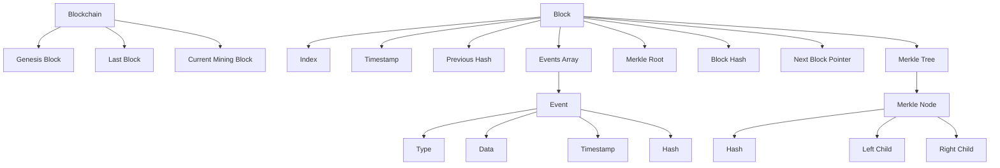
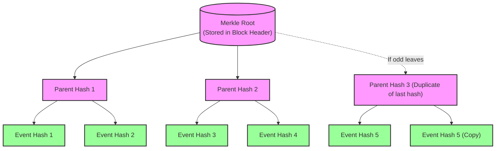

# Check the readme on github for more visibility of diagrams 

# Simple Blockchain Implementation in C

## Overview
This code implements a basic blockchain system with Merkle trees in C. It creates a data structure to store transactions securely using cryptographic hashing while maintaining historical integrity through linked blocks.

## Requirements

- gcc
- OpenSSL development libraries (libssl-dev)

##  How to Run

1. Compile the source code:
   ```bash
   gcc blockchain.c -o blockchain -lssl -lcrypto
   ```
2.Run the compiled program:
    ```bash
    ./blockchain
    ```


## Blockchain Structure
The blockchain is a linked list of blocks, where each block contains a Merkle tree of its events.

### Global Architecture
```plaintext
Blockchain
├── genesis: Block* (first block)
├── last_block: Block* (last confirmed block)
├── block_count: int
└── current_mining_block: Block* (block being mined)
```

### Block Structure
```plaintext
Block
├── index: int (sequential ID)
├── timestamp: time_t
├── previous_hash: char[HASH_SIZE+1]
├── events: Event* (dynamic array)
│   ├── type: int
│   ├── data: char[256]
│   ├── timestamp: char[30]
│   └── hash: char[HASH_SIZE+1]
├── event_count: int
├── event_capacity: int
├── nonce: int
├── merkle_root: char[HASH_SIZE+1]
├── hash: char[HASH_SIZE+1]
└── next: Block* (link to next block)
```

### Merkle Tree Structure
```plaintext
MerkleNode
├── hash: char[HASH_SIZE+1]
├── left: MerkleNode*
└── right: MerkleNode*
```

## Data Flow Graph



## Merkle tree

---

# Blockchain Core Concepts

## Proof of Work & Nonce
- **Nonce**: A "number used once" that miners vary to solve the cryptographic puzzle
- **Difficulty**: Requires finding a hash with specific leading zeros (set by `DIFFICULTY`)
- **Mining Function**: 
  ```c
  mine_block() tries nonces until valid hash found
  ```


## Mining Process
1. **Create Candidate Block**:
   - Gather pending transactions
   - Prepare block structure with metadata

2. **Compute Merkle Root**:
   - Hash all transactions into a single root hash

3. **Proof-of-Work**:
   - Iterate nonce values to find valid hash
   - Must meet difficulty target (leading zeros)

4. **Block Propagation**:
   - First successful miner broadcasts block
   - Network validates and adds to chain

# Blockchain Security and Consensus Architecture

## Security Framework

### Core Protection Mechanisms

| Mechanism          | Security Guarantee                     | System Impact                          |
|--------------------|----------------------------------------|----------------------------------------|
| **Hash Chaining**  | Tampering invalidates all future blocks | Enforces sequential block verification |
| **Merkle Trees**   | Single transaction change alters root   | Enables efficient transaction auditing |
| **Distributed P2P**| Requires 51% network compromise        | Eliminates central failure points      |

## Mining and Consensus Protocol

### Competitive Mining Process
- **Participation**: Active mining nodes (`is_mining=true`)
- **Workflow**:
  1. Parallel hash computation races
  2. First valid PoW solution wins
  3. Network-wide block validation
  4. Block reward issuance

### Fork Resolution System
```c
// Longest chain selection algorithm
if (new_chain_length > current_chain_length) {
    adopt_chain(new_block);  // Switch to longer chain
    reset_mining_work();     // Rebase mining efforts
}
```
## Conflict Resolution

### Chain Reorganization
- **Orphaned Chains**: Shorter forks are automatically abandoned by nodes
- **Propagation Priority**: Blocks that propagate faster through the network gain acceptance advantage  
- **Consensus Mechanism**: The network naturally converges on the longest valid chain

## Validation and Recovery

### Block Verification
All new blocks must pass these validation checks:
1. Valid Proof-of-Work (meets current difficulty target)
2. All transactions are legitimate (verified by `validate_block_events()`)
3. Correctly references the previous block's hash
4. Extends the longest known valid chain

### Node Recovery Process
1. **Network Synchronization**:
   - Invokes `synchronize_blockchain()` procedure
   - Discovers and verifies the longest valid chain in the network

2. **State Reconciliation**:
   - Replaces local chain with the new longest valid chain
   - Reconfigures mining operations to build upon the new chain tip

## System Architecture Benefits

### Security Properties
- **Provable Security**: Cryptographic proofs enforce integrity at all architecture layers
- **Distributed Trust**: Open participation model with no central authority
- **Self-Stabilizing**: Automatic reorganization maintains chain consistency
- **Transparent Audit**: All modifications are cryptographically detectable
- **Deterministic Finality**: Unambiguous consensus rules govern chain selection


## Immutability Mechanisms
### Cryptographic Hashing
```c
void hash_block(Block* block) {
    char buffer[1024];
    sprintf(buffer, "%d%ld%s%s%d", 
            block->index, block->timestamp,
            block->previous_hash, block->merkle_root, block->nonce);
    hash_data(buffer, block->hash);
}
```
## Hash Chaining
- Each block contains the hash of the previous block  
- Creates an immutable chain where modifying any block would invalidate all subsequent blocks

## Merkle Trees
- All events within a block are hashed into a Merkle root  
- Makes it computationally infeasible to modify any transaction without changing the blocks hash

## Distributed Storage
- Multiple nodes store copies of the entire blockchain  
- Makes it difficult for an attacker to modify all copies simultaneously

## Miner Selection
In this implementation:
- Any node with `is_mining=true` can compete to find the next valid block  
- Multiple miners work simultaneously on their chain copies  
- Winner is the first miner to find a valid hash meeting difficulty  
- Winner broadcasts their block to all nodes for validation

## Fork Resolution
Resolved through:

### Longest Chain Rule
System prefers the chain with most valid blocks:
```c
// Check if this creates a longer chain
int new_chain_length = block->index + 1;
if (new_chain_length > nodes[i].chain->block_count) {
    current->next = new_block;
    nodes[i].chain->last_block = new_block;
    nodes[i].chain->block_count = new_chain_length;
    
    free_block(nodes[i].chain->current_mining_block);
    nodes[i].chain->current_mining_block = create_block(nodes[i].chain->block_count, 
                                                     new_block->hash);
}
```
## Orphaned Blocks
- Nodes automatically abandon shorter chains when discovering longer valid ones  
- Blocks on abandoned chains become "orphaned" (no longer part of main chain)

## Network Propagation
- Blocks that propagate faster through the network have higher chance of being accepted  
- Network latency affects which chain grows fastest

## Mining Race Resolution
- Temporary chain splits occur when multiple miners find blocks simultaneously  
- Competition resolves naturally when one chain grows longer  
- Network eventually converges to single consensus chain

## Block Validation
Nodes verify new blocks by checking:
1. **Proof of Work**: Valid hash with correct leading zeros  
2. **Event Validity**: All events pass `validate_block_events()` checks  
3. **Chain Integrity**: Correct reference to previous block's hash  
4. **Chain Length**: Block extends the longest valid chain  

## Consensus Mechanism
Two-tiered consensus approach:
1. **Longest Chain Rule**: The chain with most accumulated work (blocks) wins  
2. **Majority Consensus**: `check_consensus()` confirms >51% node agreement  

## Node Synchronization
Recovery process for offline nodes:
1. **Discovery**: Calls `synchronize_blockchain()` to survey network  
2. **Adoption**: Replaces local chain with longest valid chain found  
3. **Continuation**: Begins mining new block on top of adopted chain  


## Key Features
- **Block Creation and Linking**: New blocks maintain the chain's integrity by including the previous block's hash.
- **Dynamic Event Management**: Blocks can store multiple events with automatic capacity adjustment.
- **Merkle Tree Integration**: Events in each block are secured using a Merkle tree structure.
- **Memory Management**: Proper allocation and deallocation to prevent memory leaks.

## Code Structure
- **Data Structures**: `Event`, `MerkleNode`, `Block`, and `Blockchain`
- **Hashing Functions**: Simple hash implementation (replaceable with cryptographic algorithms)
- **Merkle Tree Operations**: Creation, maintenance, and memory management
- **Blockchain Operations**: Block creation, event addition, and chain validation

## Usage Example
The `main` function demonstrates creating a blockchain, adding various transaction events, and displaying the resulting chain structure.


