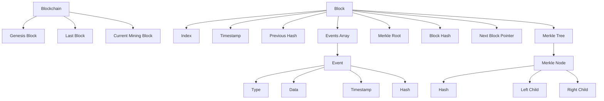
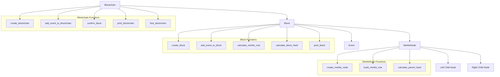

# Simple Blockchain Implementation in C

## Overview
This code implements a basic blockchain system with Merkle trees in C. It creates a data structure to store transactions securely using cryptographic hashing while maintaining historical integrity through linked blocks.

## Blockchain Structure
The blockchain is a linked list of blocks, where each block contains a Merkle tree of its events.

### Global Architecture
```plaintext
Blockchain
├── genesis: Block* (first block)
├── last_block: Block* (last confirmed block)
├── block_count: int
└── current_mining_block: Block* (block being mined)
```

### Block Structure
```plaintext
Block
├── index: int (sequential ID)
├── timestamp: time_t
├── previous_hash: char[HASH_SIZE+1]
├── events: Event* (dynamic array)
│   ├── type: int
│   ├── data: char[256]
│   ├── timestamp: char[30]
│   └── hash: char[HASH_SIZE+1]
├── event_count: int
├── event_capacity: int
├── nonce: int
├── merkle_root: char[HASH_SIZE+1]
├── hash: char[HASH_SIZE+1]
└── next: Block* (link to next block)
```

### Merkle Tree Structure
```plaintext
MerkleNode
├── hash: char[HASH_SIZE+1]
├── left: MerkleNode*
└── right: MerkleNode*
```

## Data Flow Graph



## Merkle tree

---

## Key Features
- **Block Creation and Linking**: New blocks maintain the chain's integrity by including the previous block's hash.
- **Dynamic Event Management**: Blocks can store multiple events with automatic capacity adjustment.
- **Merkle Tree Integration**: Events in each block are secured using a Merkle tree structure.
- **Memory Management**: Proper allocation and deallocation to prevent memory leaks.

## Code Structure
- **Data Structures**: `Event`, `MerkleNode`, `Block`, and `Blockchain`
- **Hashing Functions**: Simple hash implementation (replaceable with cryptographic algorithms)
- **Merkle Tree Operations**: Creation, maintenance, and memory management
- **Blockchain Operations**: Block creation, event addition, and chain validation

## Usage Example
The `main` function demonstrates creating a blockchain, adding various transaction events, and displaying the resulting chain structure.


